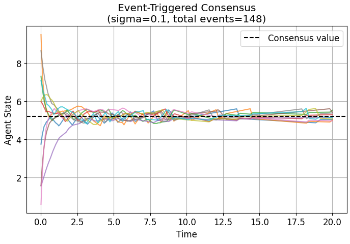

# Communication-Efficient Event-Triggered Consensus in Multi-Agent Systems

## Overview

This project investigates communication-efficient consensus protocols in multi-agent systems using event-triggered control mechanisms. A simulation framework is developed to compare continuous consensus with event-triggered strategies.

## Key Contributions

* Implemented continuous and event-triggered consensus algorithms
* Evaluated static, decaying, and neighbor-relative triggering schemes
* Achieved up to **99% reduction in communication events**
* Analyzed trade-off between communication cost and convergence speed
* Verified absence of Zeno behavior

## Methods

* Continuous consensus (baseline)
* Static threshold event-triggered consensus
* Decaying threshold triggering
* Neighbor-relative triggering

## Results

* All methods converge to the same consensus value
* Significant communication reduction (up to 99%)
* Clear trade-off between convergence and communication

## Key Result: Communication vs Convergence Trade-off

<p align="center">
  
</p>

This plot shows that increasing the triggering threshold reduces communication events but slows convergence, demonstrating a fundamental trade-off in event-triggered consensus systems.

## Example: Event-Triggered Consensus Behavior

<p align="center">
  
</p>

Agents converge to a common value under event-triggered communication, demonstrating reduced communication compared to continuous consensus.

## Technologies Used

* Python
* NumPy
* Matplotlib
* NetworkX

## How to Run

### Option 1: Jupyter Notebook

```bash
pip install -r requirements.txt
jupyter notebook
```

Open:

```
Event_Triggered_Consensus.ipynb
```

### Option 2: Run in VS Code

Open the notebook and run all cells.


## Future Work

* Extend to nonlinear dynamics
* Real-world robotic implementation
* Learning-based triggering strategies

## Course   
- **Purdue University** – AAE 59000: Multi-agent Autonomy and Control 
